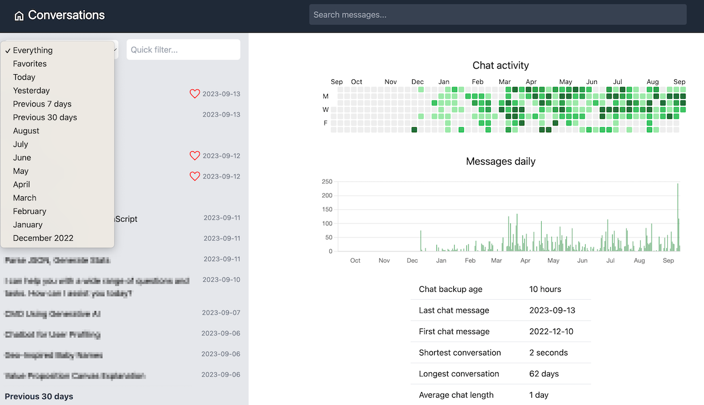

# ChatGPT history

UI for navigating and organizing OpenAI's ChatGPT conversations.

**Important**: This project is 100% unaffiliated with OpenAI.

## Features

- See activity graph and useful statistics
- Quickly browse and open the chats
- Search chats (semantic and "strict")
- List of favorite chats
- Open conversations on the ChatGPT site

[Docker Hub Image](https://hub.docker.com/layers/abalmahfadi/chat-history-app/1/images/sha256:5048890aa4a2ab8bd935a59fa12df64b7c028948d3ccd1610b35feedd77fde17?uuid=3C4FE425-AC33-44B0-8EE4-A1C54D21A883)

## Setup

Currently can only be installed locally. Requires Python 3.10+

1. [Export ChatGPT history](https://help.openai.com/en/articles/7260999-how-do-i-export-my-chatgpt-history-and-data)
2. Unzip the download, place `conversations.json` in the `data` folder
3. `docker build -t chat-history-app .`
4. `docker run -p 80:80 chat-history-ap`
5. Open http://127.0.0.1 in your browser
6. *Optional* - copy `secrets.template.toml` to `data/secrets.toml` and update OpenAI API key, then restart the server. First run will take a while to create embeddings. 10MB JSON: ~30 min, ~$0.10 cost.
